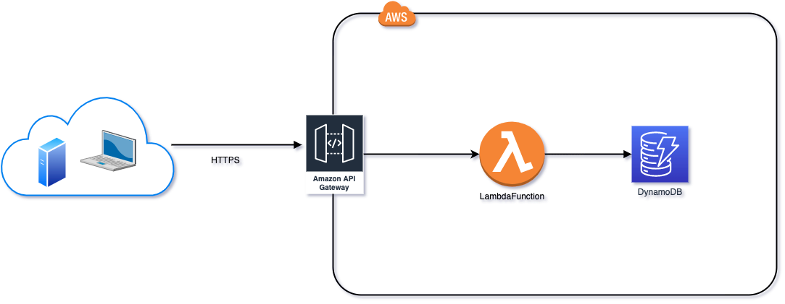

# ApiService project using AWS

This is a ApiService project. 

It contains the integration of the following Amazon Web Services:

- API Gateway
- Lambda Function
- DynamoDB
- AWS CDK -> Cloud Formation





Make sure to install aws cdk toolkit and have python3.9+ installed.

https://docs.aws.amazon.com/cdk/v2/guide/getting_started.html

Create a virtual environment

```
python3 -m venv .venv
```

Activate a virtual environment

```
$ source .venv/bin/activate
```

If you are a Windows platform, you would activate the virtualenv like this:

```
% .venv\Scripts\activate.bat
```

Once the virtualenv is activated, you can install the required dependencies.

```
$ pip install -r requirements.txt
```

At this point you can now synthesize the CloudFormation template for this code.

```
$ cdk synth
```

To add additional dependencies, for example other CDK libraries, just add
them to your `setup.py` file and rerun the `pip install -r requirements.txt`
command.

## Useful commands

 * `cdk ls`          list all stacks in the app
 * `cdk synth`       emits the synthesized CloudFormation template
 * `cdk deploy`      deploy this stack to your default AWS account/region
 * `cdk diff`        compare deployed stack with current state
 * `cdk docs`        open CDK documentation
 
